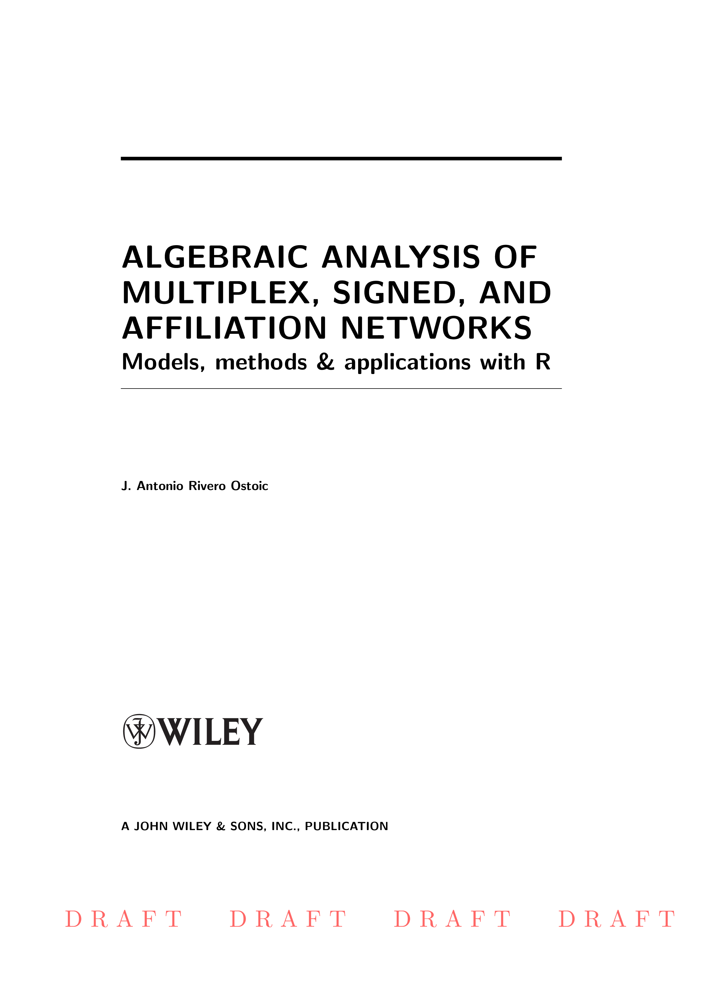

## Sunbelt 2018 Workshop  
## WS07: Algebraic analysis of multiplex, signed, and two-mode networks

**DATE: TUESDAY, 26 JUNE between 09:00 - 12:00  (morning session).**
  
 
**VENUE:**  
Utrecht University Campus "De Uithof"  
Leuvenlaan 19  
3584 CE Utrecht  
*Ruppert building - Room 134* 
 

**Useful information**  
*Network:* UU-Visitor  
*Password:* No password required
  

This workshop is based on the forthcomming book:

